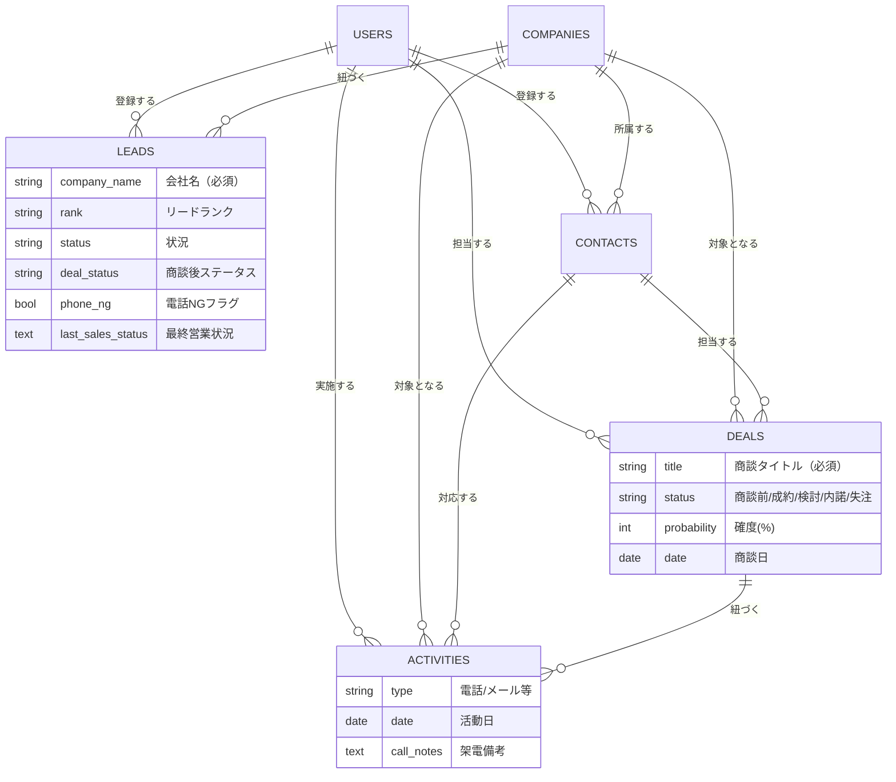

# CRM-kadai — 営業活動を一元管理する CRM システム

リード獲得から架電・商談・受注までの営業フローを 1 つの画面で追える、Laravel 製の CRM アプリケーションです。
**実務を想定した設計書ベースの開発**（要件定義 → 実装 → テスト → VPS デプロイ）を、個人で一通り完遂しました。

<p>
  
  
  
  
  
  
</p>

---

## 🚀 デモ環境

**https://crm-kadai.top**（ConoHa VPS 上で稼働中 / Let's Encrypt による HTTPS 化済み）

| 項目 | 値 |
| --- | --- |
| Email | `test@example.com` |
| Password | `password` |

> ログイン後、サイドバーから「会社 / 連絡先 / リード / 商談 / 活動」の各機能をご確認いただけます。

---

## 💡 このプロダクトで解決したい課題

営業現場では「どの見込み客に、誰が、いつ、何をしたか」がスプレッドシートや個人の記憶に分散しがちです。
本システムは以下を 1 つのデータモデルに集約し、**次に架電すべき相手が一覧から分かる状態**を目指しています。

- 見込み客（リード）の獲得・ランク付け
- 架電履歴と「電話 NG」フラグの管理
- 商談ステータス（商談前 / 検討 / 内諾 / 成約 / 失注）の遷移
- 担当ユーザー別の活動量の可視化

---

## ✨ 主な機能

| 機能 | 概要 |
| --- | --- |
| **ダッシュボード** | 商談ステータス別件数・リードランク別件数・直近 10 件の活動・担当者別活動量を集計表示 |
| **会社管理** | CRUD ＋ 会社名の部分一致検索（`LIKE` 検索） |
| **連絡先管理** | CRUD ＋ 会社に紐づく担当者の管理 |
| **リード管理** | CRUD ＋ ランク / 状況 / 商談後ステータスによる複合フィルタ |
| **CSV インポート / エクスポート** | リードの一括登録・出力。BOM 付き UTF-8 対応（Excel で文字化けしない）、行単位のエラー検出 |
| **商談管理** | CRUD ＋ 商談名 / 会社 / ステータスによる複合フィルタ |
| **活動管理** | 架電・メール等の活動履歴、電話 NG フラグ、最終営業状況の記録 |
| **認証** | ログイン / 登録 / メール認証 / パスワードリセット / プロフィール・パスワード変更 |
| **内部 API** | 会社選択に応じて連絡先・商談を返す JSON API（フォームの動的絞り込みに使用） |

---

## 🛠 技術スタック

| レイヤー | 採用技術 |
| --- | --- |
| バックエンド | Laravel 12.0 / PHP 8.2+ |
| フロントエンド | Livewire + Volt、Flux UI、Blade |
| スタイリング | Tailwind CSS 4.0 |
| ビルド | Vite |
| データベース | SQLite（PostgreSQL / MySQL への移行を想定した設計） |
| テスト | Pest 3 |
| 品質管理 | Laravel Pint / GitHub Actions |
| インフラ | ConoHa VPS、Nginx、PHP-FPM、Certbot（Let's Encrypt） |

---

## 🗂 データモデル



リードは「会社に紐づく前の見込み客」として `company_id` を NULL 許容にし、
商談化のタイミングで会社レコードと接続できる設計にしています。

---

## 🧭 アーキテクチャ

CRUD 画面は **Controller + Blade**、認証・設定まわりは **Livewire / Volt コンポーネント**という
責務分担にしています（Livewire スターターキットの資産を活かしつつ、CRUD は MVC の学習主目的に合わせた構成）。

```
app/
├── Http/Controllers/
│   ├── DashboardController.php   # 集計クエリ（groupBy / selectRaw）
│   ├── CompanyController.php     # CRUD + 部分一致検索
│   ├── ContactController.php
│   ├── LeadController.php        # CRUD + CSVインポート/エクスポート
│   ├── DealController.php        # CRUD + 複合フィルタ
│   ├── ActivityController.php
│   └── Api{Contact,Deal}Controller.php  # 内部JSON API
├── Models/                       # User / Company / Contact / Lead / Deal / Activity
└── Livewire/Actions/

resources/views/dashboard/        # 各リソースの index / create / edit / show
routes/web.php                    # auth ミドルウェアで全業務ルートを保護
docs/                             # 基本設計.md / 機能拡張.md
要件定義書.md                      # 要件定義書 v2.0
```

### コード面でこだわった点

**1. 検索は「条件があるときだけ」クエリに積む**

`when()` で条件付きクエリを組み立て、フィルタ未指定時に余計な WHERE 句を発行しないようにしています。

```php
$deals = Deal::query()
    ->with(['company', 'contact'])                       // N+1 を防ぐ Eager Loading
    ->when($title,     fn ($q, $title)  => $q->where('title', $title))
    ->when($companyId, fn ($q, $id)     => $q->where('company_id', $id))
    ->when($status,    fn ($q, $status) => $q->where('status', $status))
    ->get();
```

**2. CSV は大量データを想定してストリーミング出力**

エクスポートは `chunk(500)` ＋ `StreamedResponse` で、件数が増えてもメモリを圧迫しません。
Excel での文字化けを防ぐため UTF-8 BOM を付与しています。

**3. 構造化ログ（JSON）**

`config/logging.php` に JSON フォーマッタのチャンネルを追加し、`storage/logs/laravel.json` に構造化ログを出力。
grep 前提のテキストログではなく、後から機械的に解析できる形にしています。

---

## ✅ 品質への取り組み

- **自動テスト（Pest）** — 認証 / 会社 / 連絡先 / 商談 / ダッシュボード / 設定を Feature・Unit テストでカバー
- **CI（GitHub Actions）** — `main` への push・PR で、依存関係のインストール → アセットビルド → Pest 実行を自動化（[tests.yml](.github/workflows/tests.yml)）
- **静的整形（Laravel Pint）** — PSR 準拠のコードスタイルを CI でチェック（[lint.yml](.github/workflows/lint.yml)）
- **セキュリティ** — Laravel 標準の CSRF 保護、Eloquent によるプレースホルダ化（SQL インジェクション対策）、`$fillable` によるマスアサインメント保護、パスワードハッシュ化

```bash
composer test        # テスト実行
vendor/bin/pint      # コード整形
```

---

## 🏃 ローカル環境での起動

```bash
git clone git@github.com:nanasinogonbei-493561/CRM-kadai.git
cd CRM-kadai

composer install
npm install

cp .env.example .env
php artisan key:generate

touch database/database.sqlite
php artisan migrate --seed

composer dev   # server / queue / logs / vite を同時起動
```

ブラウザで `http://localhost:8000` にアクセスしてください。

---

## 🧗 開発で詰まった点と、その解決

| 課題 | 原因 | 対応 |
| --- | --- | --- |
| **デプロイ後にログイン画面が表示されない** | 本番でフロントエンドアセットがビルドされておらず、Vite の参照が解決できていなかった | ブラウザのコンソールと Nginx のログから参照エラーを特定し、`npm run build` をデプロイ手順に組み込んで解消 |
| **マイグレーションが順序依存で失敗** | `deals` のマイグレーション内で `activities` のカラムを変更しており、テーブル作成順に依存していた | 責務ごとにマイグレーションを分離し、テーブル作成と外部キー追加を別ファイルへ切り出し |
| **フィルタ検索で SQL エラー** | 条件を無条件に WHERE 句へ連結していた | 公式ドキュメントを読み込み、`when()` による条件付きクエリビルドへリファクタリング。会社名検索も完全一致から部分一致（`LIKE`）へ改善 |

---

## 📚 この開発を通して学んだこと

- **MVC と責務分離** — Model（データ）、View（表示）、Controller（橋渡し）の役割を、実装しながら腹落ちさせた
- **バリデーション設計** — `required` / `exists` / `in` などのルールと、日本語のカスタムエラーメッセージ
- **クエリビルダ** — `when()` / `with()`（Eager Loading）/ `groupBy` + `selectRaw` による集計
- **API の設計と利用** — 「アプリ同士をつなぐコンセント」としての API を、フロント側の呼び出しとバック側の JSON レスポンス双方から実装
- **構造化ログ** — 運用時に解析可能なログを出す意味と設定方法
- **インフラ / デプロイ** — VPS のセットアップ、Nginx + PHP-FPM の構成、DNS 設定、Certbot による SSL 化まで自力で完遂

学習の過程は Zenn のスクラップに記録しています 👉 https://zenn.dev/nanashinogonbei/scraps/f7066c71845886

---

## 🗺 今後の展望

- [ ] メール開封・返信状況に応じたリードの**自動ランク付け**
- [ ] ランク別のメール一括送信
- [ ] 会社 / 商談 / 活動の CSV エクスポート対応（現在はリードのみ）
- [ ] PostgreSQL / MySQL への移行と Redis キャッシュ導入
- [ ] E2E テストの追加とテストカバレッジの向上

---

## 📄 関連ドキュメント

- [要件定義書.md](要件定義書.md) — 機能要件・非機能要件・DB 設計・開発フェーズ
- [docs/基本設計.md](docs/基本設計.md) — 基本設計
- [docs/機能拡張.md](docs/機能拡張.md) — 機能拡張の設計

---

## 📅 開発期間

**2025 年 9 月 〜 2026 年 現在**（個人開発 / 継続中）

| フェーズ | 内容 | 状況 |
| --- | --- | --- |
| Phase 1 | 環境構築・認証・基本 UI | ✅ 完了 |
| Phase 2 | 会社 / 連絡先 / 商談 / 活動の CRUD | ✅ 完了 |
| Phase 3 | ダッシュボード拡充・商談ステータス整備・VPS デプロイ | ✅ 完了 |
| Phase 4 | リード管理・CSV インポート / エクスポート | 🚧 対応中 |
| Phase 5 | 自動ランク付け・最適化・テスト拡充 | ⏳ 予定 |
